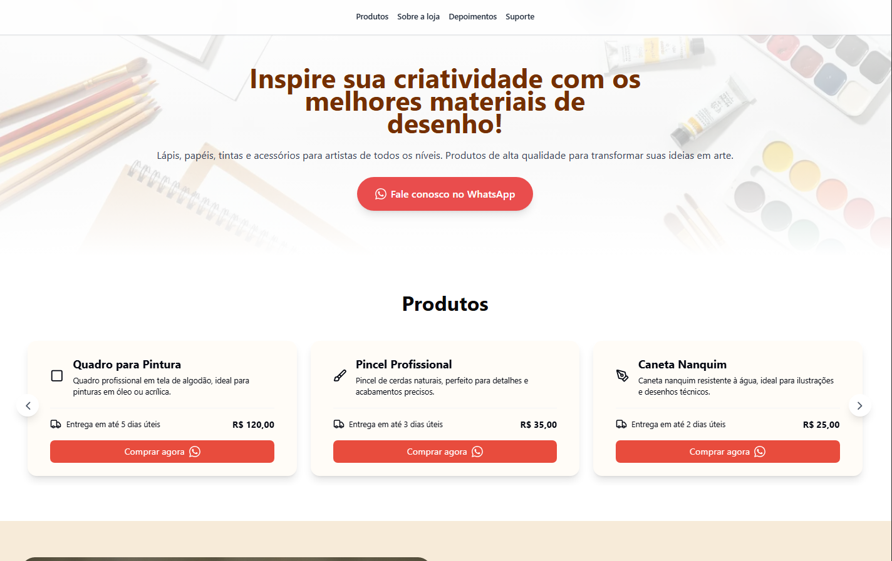
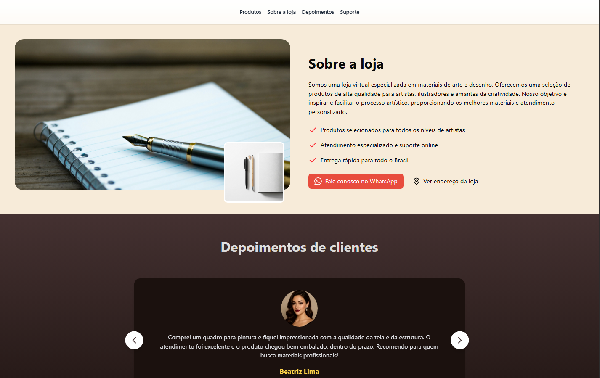
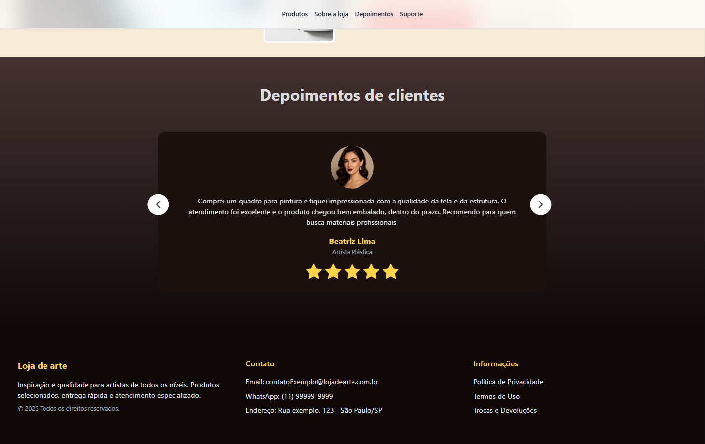

# Landing Page da Loja de Arte

## Visão Geral

Este é um projeto de estudo que apresenta uma landing page para uma loja de arte e materiais de desenho. O principal objetivo é aprimorar as habilidades de desenvolvimento front-end, com foco na criação de interfaces de usuário atraentes e responsivas.

## Tecnologias Utilizadas

- **Next.js:** Um framework React para a construção de aplicações web modernas e eficientes.

## Estrutura do Projeto

O código-fonte está organizado da seguinte forma:

- **/public:** Contém os ativos estáticos, como imagens e fontes.
- **/src:** Inclui os principais componentes e páginas da aplicação.

## Funcionalidades

- **Layout Responsivo:** A landing page é totalmente responsiva, adaptando-se a diferentes tamanhos de tela (desktop, tablet e mobile).
- **Design Atraente:** A interface foi cuidadosamente projetada para oferecer uma experiência visual agradável e intuitiva.

## Imagens da Aplicação

